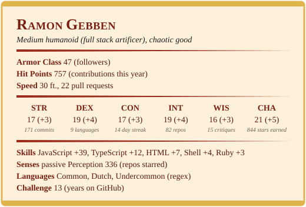

  

  

> *A wandering artificer from Utrecht, The Netherlands. By day I forge full stack web apps; by night I run the table
> as Dungeon Master and build cosplay props that occasionally boot an operating system.*

## 🎲 Character sheet

  

Rerolled daily by a <a href=".github/workflows/character-sheet.yml">GitHub Action</a> from my actual GitHub activity.

## 📜 Quest log

### Active quests

| Quest | Scroll |
| --- | --- |
| ⚔️ **[kernel-dm-toolbox](https://github.com/RamonGebben/kernel-dm-toolbox)** | A self-hosted DM toolbox for one campaign: initiative tracker, SRD 5.2 spell lookup and a fog-of-war battle map, each with a player-facing second screen. |
| 🔪 **[mise](https://github.com/RamonGebben/mise)** | *Mise en place* for code: my conventions packaged as shared configs and Claude Code plugins. One `npx` and a project is set up my way. |
| 📸 **[HyvesFoto.nl](https://github.com/RamonGebben/HyvesFoto.nl)** | Crop and collage photos for the Hyves timeline, entirely in the browser. Nothing gets uploaded and nobody gets cropped through the face. |

### Legendary loot

| Artifact | Lore | Renown |
| --- | --- | --- |
| 🗡️ **[react-perf-tool](https://github.com/RamonGebben/react-perf-tool)** | Debugged the performance of React apps back in the day. Retired, but the stars remain. |  |
| ✨ **[Cquence](https://github.com/RamonGebben/Cquence)** | A very small JavaScript animation library. |  |
| 📊 **[data-drive](https://github.com/RamonGebben/data-drive)** | Talk to Google Spreadsheets as if they were a database. |  |

## 🐦 Send a raven

  
  
  

